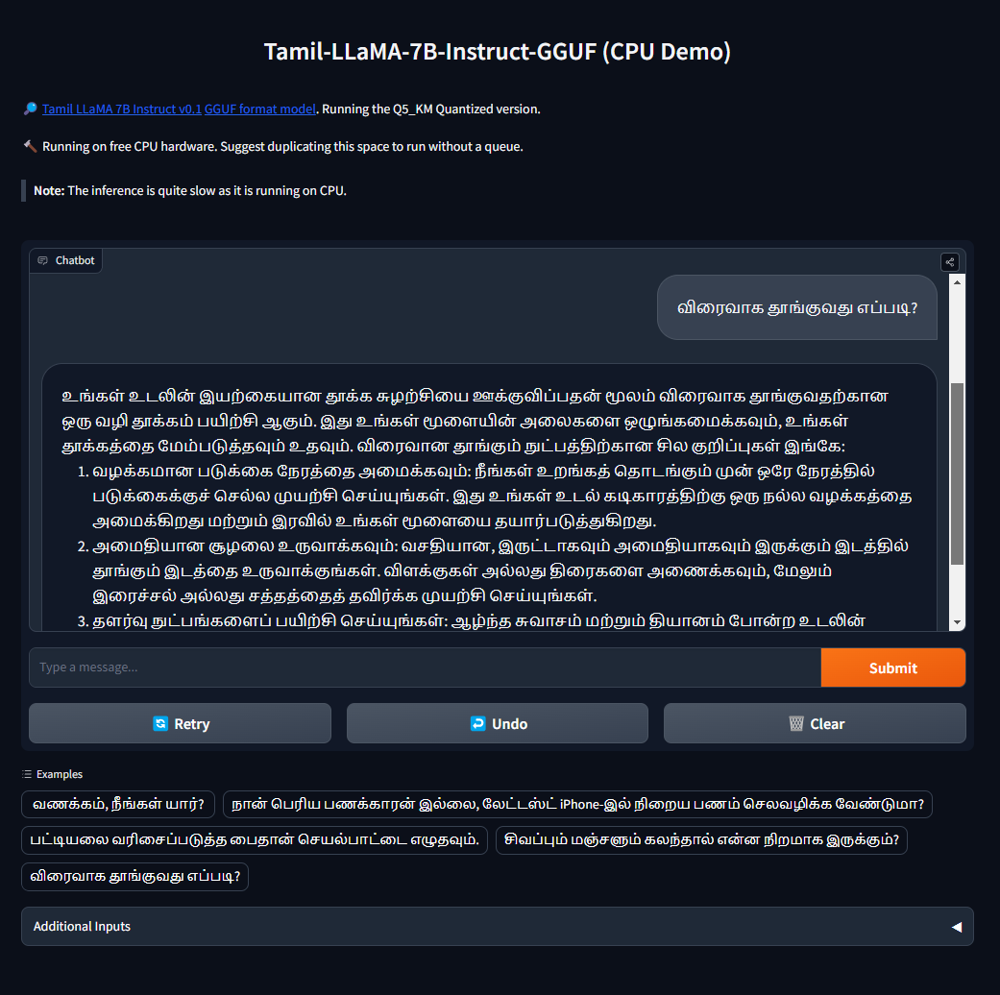

# Tamil-Llama: A Family of LLaMA-based LLMs focused on Tamil Language


## Description

This repository contains the code and models for "Tamil-Llama", a project focused on enhancing the performance of language models for the Tamil language. It builds upon the open-source LLaMA model, introducing additional Tamil tokens and employing the LoRA methodology for efficient training. Please read the technical report for more details.

Technical Report: [https://arxiv.org/abs/2311.05845](https://arxiv.org/abs/2311.05845)

If you appreciate this work and would like to support its continued development, consider [buying me a coffee](https://www.buymeacoffee.com/abhinand.b). Your support is invaluable and greatly appreciated.

[](https://www.buymeacoffee.com/abhinand.b)

## Table of Contents


- [Available Models](#available-models)
- [Benchmark Scores](#benchmark-scores)
- [Demo](#demo)
- [Getting Started](#getting-started)
- [Datasets](#datasets)
- [Prompting Format](#prompting-format-for-instruction-models)
- [Usage Note](#usage-note)
- [Contributions](#contributions)
- [License](#license)
- [Citation](#citation)
- [Contact](#contact)

## Available Models

| Model                    | Type                        | Data              | Base Model           | # Params | Download Links                                                         |
|--------------------------|-----------------------------|-------------------|----------------------|------|------------------------------------------------------------------------|
| Tamil LLaMA 7B Base      | Base model                  | 12GB              | LLaMA 7B             | 7B   | [HF Hub](https://huggingface.co/abhinand/tamil-llama-7b-base-v0.1)     |
| Tamil LLaMA 13B Base     | Base model                  | 4GB               | LLaMA 13B            | 13B  | [HF Hub](https://huggingface.co/abhinand/tamil-llama-13b-base-v0.1)    |
| Tamil LLaMA 7B Instruct  | Instruction following model | 145k instructions | Tamil LLaMA 7B Base  | 7B   | [HF Hub](https://huggingface.co/abhinand/tamil-llama-7b-instruct-v0.1) |
| Tamil LLaMA 13B Instruct | Instruction following model | 145k instructions | Tamil LLaMA 13B Base | 13B  | [HF Hub](abhinand/tamil-llama-13b-instruct-v0.1)                       |

### Quantized Version of Available Models

| Model                    | Format | Bits                 | Download Links                                                               |
|--------------------------|--------|----------------------|------------------------------------------------------------------------------|
| Tamil LLaMA 7B Base      | GGUF   | Q4_K_M, Q5_K_M, Q8_0 | [HF Hub](https://huggingface.co/abhinand/tamil-llama-7b-base-v0.1-gguf)      |
| Tamil LLaMA 13B Base     | GGUF   | Q4_K_M, Q5_K_M, Q8_0 | [HF Hub](https://huggingface.co/abhinand/tamil-llama-13b-base-v0.1-gguf)     |
| Tamil LLaMA 7B Instruct  | GGUF   | Q4_K_M, Q5_K_M, Q8_0 | [HF Hub](https://huggingface.co/abhinand/tamil-llama-7b-instruct-v0.1-gguf)  |
| Tamil LLaMA 13B Instruct | GGUF   | Q4_K_M, Q5_K_M, Q8_0 | [HF Hub](https://huggingface.co/abhinand/tamil-llama-13b-instruct-v0.1-gguf) |

## Benchmark Scores

Scores are calculated using the HuggingFace [Open LLM Leaderboard](https://huggingface.co/spaces/HuggingFaceH4/open_llm_leaderboard).

> **Note:** The benchmarks test the model's capabilities in English reasoning, although the Tamil LLaMA models were not trained on quality reasoning tasks in English it shows decent performance across most benchmarks.

| Model                    | Average | ARC   | HellaSwag | MMLU  | TruthfulQA | Winogrande | GSM8K |
|--------------------------|---------|-------|-----------|-------|------------|------------|-------|
| Tamil LLaMA 13B Instruct | **51.59**   | **54.52** | 79.35     | 50.37 | 41.22      | **76.56**      | **7.51**  |
| Tamil LLaMA 13B Base     | 49.5    | 52.82 | **79.95**     | **52.05** | 36.56      | 75.61      | 0     |
| Tamil LLaMA 7B Instruct  | 45.52   | 48.04 | 70.97     | 39.95 | **41.7**       | 70.64      | 1.82  |
| Tamil LLaMA 7B Base      | 44.52   | 46.67 | 72.85     | 40.95 | 35.93      | 70.72      | 0     |

## Demo

A simple interactive demo of Tamil-LLaMA-7B-Instruct-v0.1 is hosted in the HuggingFace Space here -> [abhinand/tamil-llama-playground](https://huggingface.co/spaces/abhinand/tamil-llama-playground)



## Getting Started

### Using LMStudio:

[LM Studio](https://lmstudio.ai/), an easy-to-use and powerful local GUI for Windows and macOS (Silicon), with GPU acceleration. Linux available, in beta as of 27/11/2023.

1. **Download and Install LM Studio**: Begin by downloading LM Studio from the official website.

2. **Locate the Tamil Llama Model**: After installation, open LM Studio and use the search bar to find the "Tamil Llama" model. Alternatively, if you have the GGUF model ID, paste it directly into the search bar.

3. **Download the Appropriate Model Variant**: Depending on your system's specifications, select the appropriate variant of the Tamil Llama model. Click on the 'Download' button to start the download process.

4. **Import the Preset JSON File**: Once the model is downloaded, navigate to the 'Chat' tab in LM Studio. In the settings, find the 'Preset' menu and click on the dropdown. Select "Import Preset From File" and import the preset JSON file located at [config/lm_studio/model_config.json](config/lm_studio/model_config.json) in the repository.

5. **Select and Load the Model**: Click on "Select a model to load" located on the top bar. From the list, choose the Tamil Llama variant that you previously downloaded.

6. **Initiate Conversations with the Model**: The Tamil Llama model is now ready to use. You can start engaging in conversations in the chat area of LM Studio.

### Using with Ollama:

1. **Verify Ollama Installation**: First, ensure that [Ollama](https://github.com/jmorganca/ollama) is correctly installed on your system. If not, install it from the official source.

2. **Download the Modelfile**: Access the GitHub repository and download the [Modelfile](config/ollama/Modelfile). This file is necessary for setting up the Tamil Llama model in Ollama.

3. **Prepare the Working Directory**: Place the downloaded `Modelfile` and the model's GGUF file in the same directory. To work in this directory, use the `cd` command in your terminal to change to the appropriate directory.

4. **Download the Tamil Llama Model**: Execute the following command in your terminal to download the desired Tamil Llama model from the GitHub repository:

   ```bash
   curl -L https://huggingface.co/abhinand/tamil-llama-7b-instruct-v0.1-gguf/resolve/main/tamil-llama-7b-v0.1-q8_0.gguf -o tamil-llama.gguf
   ```

   This command downloads the Tamil Llama model GGUF file and saves it as `tamil-llama.gguf` in your current directory.

5. **Import and Run the Model in Ollama**: After downloading the model, use the following command to create and run the Tamil Llama model in Ollama:

   ```bash
   ollama create tamil-llama -f Modelfile 
   ```

   This command imports the Tamil Llama model into Ollama and prepares it for use. 

Optionally, depending upon your system's capabilities make sure to configure these parameters in the Modelfile too:

```
PARAMETER num_thread 8
PARAMETER num_gpu 0
```

For more information regarding the Modelfile's available parameters check out the [official docs](https://github.com/jmorganca/ollama/blob/main/docs/modelfile.md).

## Datasets

The repository includes a Tamil-translated version of the Alpaca dataset and a subset of the OpenOrca dataset, which are used for instruction fine-tuning and evaluation.

**Tamil Alpaca**: [abhinand/tamil-alpaca](https://huggingface.co/datasets/abhinand/tamil-alpaca)

**Tamil Alpaca Orca**: [abhinand/tamil-alpaca-orca](https://huggingface.co/datasets/abhinand/tamil-alpaca-orca)

**Tamil LLaMA Eval**: [abhinand/tamil-llama-eval](https://huggingface.co/datasets/abhinand/tamil-llama-eval)

## Prompting Format for Instruction Models

**Prompt Template Without Input**

```
{system_prompt}

### Instruction:
{instruction or query}

### Response:
{response}
```

**Prompt Template With Input**

```
{system_prompt}

### Instruction:
{instruction or query}

### Input:
{input}

### Response:
{response}
```

## Usage Note

It's important to note that the models have not undergone detoxification. Therefore, while they possess impressive linguistic capabilities, there is a possibility for them to generate content that could be deemed harmful or offensive. We urge users to exercise discretion and supervise the model's outputs closely, especially in public or sensitive applications.

## Contributions

We welcome contributions to this project. If you have suggestions or improvements, please open an issue or a pull request.

## License

This project is licensed under the GNU GPL v3.0 license - see the [LICENSE.md](LICENSE) file for details.

> **IMPORTANT**: The [GPL 3.0 License](LICENSE) is applicable solely to the source code and datasets provided. As this project is a derivative of Meta's LLaMA 2 model, it is subject to the original licensing of LLaMA 2, which cannot be altered. Therefore, for comprehensive details regarding the licensing of the model, please consult the [LLAMA2-LICENSE](LLAMA2-LICENSE) file.

## Citation

If you use this model or the Tamil-Llama dataset in your research, please cite:

```bibtex
@misc{balachandran2023tamilllama,
      title={Tamil-Llama: A New Tamil Language Model Based on Llama 2}, 
      author={Abhinand Balachandran},
      year={2023},
      eprint={2311.05845},
      archivePrefix={arXiv},
      primaryClass={cs.CL}
}
```

## Contact

For any queries regarding the codebase or research, please reach out to Abhinand Balachandran at abhinandb.ml@gmail.com.
